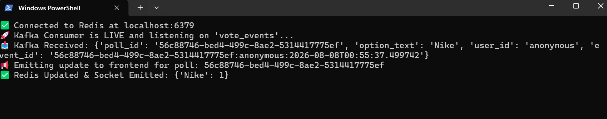
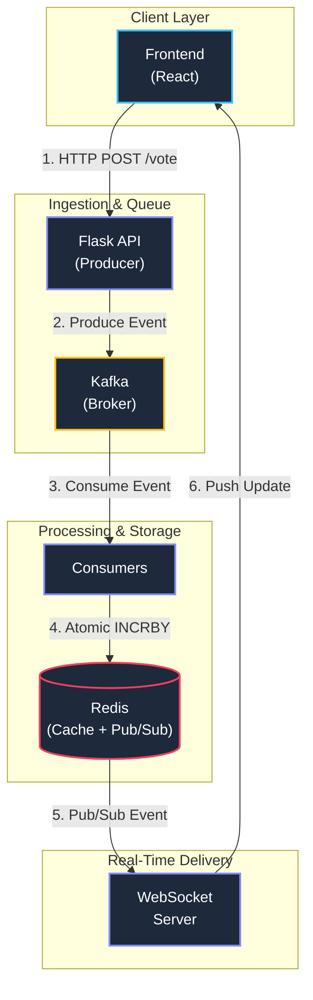
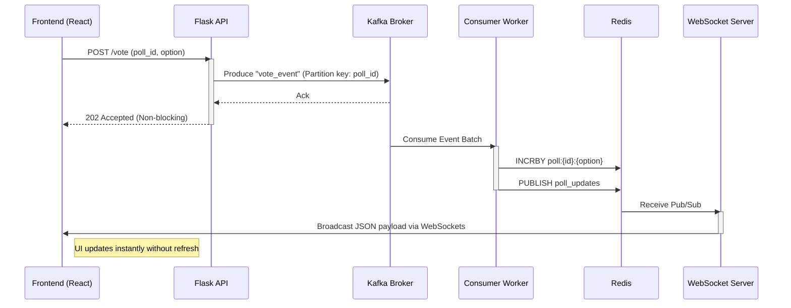

# 🗳️ Real Time Voting System

A distributed, event driven real time voting platform designed for high throughput ingestion, sub second latency, and horizontal scalability.

[](./frontend/README.md)
[](./backend/README.md)

---
## 📷 Screenshots




---

## 📖 Quick Links & Documentation

* ⚙️ **[Backend Documentation](./backend/README.md)** – Detailed Flask API contracts, Kafka consumer logic, and DB migrations.
* 🎨 **[Frontend Documentation](./frontend/README.md)** – React setup, state management, UI components, and WebSocket hooks.
* 🛠️ **[Architecture Docs](./docs/architecture.md)** – Deep dive design choices, throughput calculations, and reliability considerations.

---

## 🎯 System Objectives

* **High Throughput:** Non-blocking vote ingestion capable of buffering spikes using Kafka.
* **Real-Time Delivery:** Instant UI updates via WebSockets powered by Redis Pub/Sub.
* **Fault Tolerance:** At least once message processing with decoupled producer/consumer components.
* **Scalability:** Fully containerized components ready for horizontal scaling.

---

## 🚀 Tech Stack

| Layer | Technology | Role |
| :--- | :--- | :--- |
| **Frontend** | React, Tailwind CSS | Client UI & real time result displays |
| **Ingestion API** | Flask, Gunicorn | High speed, stateless vote ingestion |
| **Message Broker** | Apache Kafka, Zookeeper | Event streaming, decoupling, & rate buffering |
| **Worker Queue** | Python Consumers | Parallel event aggregation & state sync |
| **Cache & Pub/Sub** | Redis | In memory count storage & WebSocket fan-out |
| **Realtime Engine** | WebSocket Server | Sub second push notifications to UI |
| **Orchestration** | Docker, Docker Compose | Infrastructure deployment |

---

## 🏗️ High-Level Architecture


---

## ⚡ End-to-End Workflow


---

##  🛠️ System Components & Design Choices. 

### 1. Flask API (Ingestion)

- Design Strategy: Immediate return ($202\text{ Accepted}$) upon successfully publishing to Kafka.

- Payload:

```json
{
  "user_id": "u123",
  "poll_id": "p456",
  "option": "A",
  "timestamp": "2026-03-19T10:00:00Z"
}
```


### 2. Kafka Event Streaming: 
   
-  Topic : ```votes```
-  
-  Partition Key: ```poll_id``` (Ensures strict ordering of votes per individual poll).
 
### 3. Redis Data Structure

- Hash Storage: poll:{poll_id} $\rightarrow$ {"A": 120, "B": 95}

- Pub/Sub Channel: ```poll_updates```

---

## Quick Start
**Prerequisites:**
- Docker Desktop
- Python 3.9+
- Node.js 18+

**1. Boot Infrastructure (Kafka & Redis)**
```bash
docker-compose up -d
```

**2. Run Local Services**
Follow the setup guides in each module directory:
- **Backend Service Setup**
- **Frontend Application Setup**

- TERMINAL 1: Infrastructure

```bash
cd realtime-voting-system
docker-compose up -d
```

- TERMINAL 2: Flask API 

```bash
cd backend
source venv/bin/activate
python run.py
```

- TERMINAL 3: Kafka Consumer 

```bash
cd backend
source venv/bin/activate
python -m backend.app.consumers.vote_consumer
```

- TERMINAL 4: WebSocket Server

```bash
cd backend
source venv/bin/activate
python websocket_server.py
```

- TERMINAL 5: Frontend 

```bash
cd frontend
npm install        # first time only
npm run dev
```
---

## Backend Tests 

```bash
cd backend
pytest tests/test_smoke.py -v
pytest tests/test_vote.py -v
```

### BROWSER: Manual Testing 

1. Open http://localhost:3000
2. Click "Create Your First Poll"
3. Enter question, options, pick duration
4. Submit → redirects to new poll
5. Vote on an option → confetti + live count updates
6. Open second browser/incognito → vote as different user
7. Watch both browsers update in real-time
8. Wait for timer to expire → winner banner appears

### Quick Troubleshooting

| Issue                      | Fix                                                      |
| -------------------------- | -------------------------------------------------------- |
| `Port 5000 already in use` | `lsof -ti:5000 \| xargs kill -9`                         |
| `ModuleNotFoundError`      | `pip install -r requirements.txt`                        |
| `Kafka not connecting`     | Wait 10s after `docker-compose up`, then retry           |
| `CORS error in browser`    | Check `VITE_API_URL` matches `http://localhost:5000/api` |
| `Socket not updating`      | Check WebSocket server is running on port 8000           |
| `npm install fails`        | Delete `node_modules` and `package-lock.json`, retry     |


---

## 📊 Default Port Allocations


Service | Address |Access |
| :--- | :--- | :--- |
| React Frontend | http://localhost:3000 | Web UI |
| Flask API | http://localhost:5000 | REST API |
| WebSocket Server | ws://localhost:8000 | Socket Connection |
| Kafka Broker | localhost:9092 | Internal Queue |
| Redis Server | localhost:6379 | Cache / PubSub |

---

## 📈 Scalability & Reliability Matrix

Challenge | Architecture Solution |
| :--- | :--- |
| Traffic Spikes | Kafka buffers incoming votes; Flask processes non blocking requests. |
| Database Overload | Direct updates bypass persistent DBs, writing directly to Redis in memory structures. |
| Consumer Lag | Increase partition count on the votes topic and scale the Consumer Group workers horizontally. |
| Duplicate Votes | Process idempotency keys inside consumer workers before persisting updates. |

---


## 🤝 Contributing

1. Fork the project repository.

2. Create your feature branch: git checkout -b feature/AmazingFeature

3. Commit your updates: git commit -m 'Add some AmazingFeature'

4. Push to the branch: git push origin feature/AmazingFeature

5. Open a Pull Request targeting the main branch.