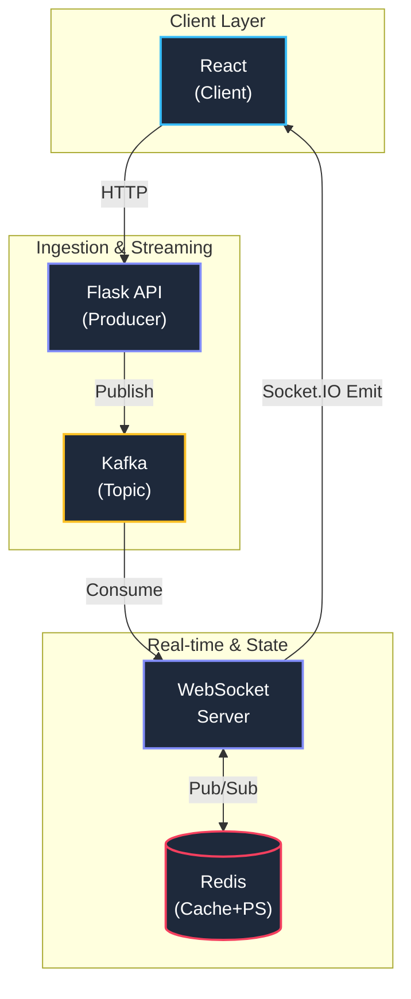

# Real-Time Voting System — Backend

A distributed, event driven backend for real-time polling built with **Flask**, **Redis**, **Kafka**, and **SQLite**.

[
](https://www.docker.com/)
[](https://www.python.org/)
[](https://flask.palletsprojects.com/)
[](https://redis.io/)
[](https://kafka.apache.org/)
[](https://www.sqlite.org/)

## Architecture



## Tech Stack

| Layer        | Technology |
|--------------|------------|
| API          | Flask      |
| Message Bus  | Kafka      |
| Cache / RT   | Redis      |
| Database     | SQLite     |
| Real-Time    | Socket.IO  |
| Infra        | Docker     |

## Quick Start

### 1. Start Infrastructure

```bash
docker-compose up -d
```

This starts Zookeeper, Kafka, and Redis.

### 2. Install Dependencies

```bash
cd backend
python -m venv venv
source venv/bin/activate  # Windows: venv\Scripts\activate
pip install -r requirements.txt
```

### 3. Seed the Database

```bash
python -m backend.infrastructure.database.seed
```

### 4. Run Services

Run each in a separate terminal:

```bash
# Flask API
python run.py

# Kafka Consumer
python -m backend.app.consumers.vote_consumer

# WebSocket Server
python -m backend.app.api.websocket_server
```

## API Endpoints

| Method | Endpoint | Description |
|--------|----------|-------------|
| GET | `/health` | Health check |
| POST | `/polls` | Create a new poll |
| GET | `/polls` | List all polls with status |
| GET | `/polls/<id>` | Get poll detail with timer status |
| POST | `/polls/<id>/vote` | Cast a vote (atomic, one per user) |
| GET | `/polls/<id>/results` | Get live vote counts |

## Vote Flow

1. **Client** sends vote to Flask API
2. **Redis SETNX** atomically checks if user already voted
3. **SQLite** persists the vote record
4. **Kafka** receives the vote event for async processing
5. **Consumer** increments Redis hash and emits via Socket.IO
6. **All clients** receive live update instantly

## Anti-Cheat Measures

- **Redis atomic lock** (`SETNX`) prevents race condition double voting
- **Consumer deduplication** ignores duplicate Kafka events
- **Time-gated voting** — polls auto close at `end_time`
- **DB rollback** on Redis lock if SQLite write fails

## Environment Variables

```bash
KAFKA_BROKER=localhost:9092
REDIS_HOST=localhost
REDIS_PORT=6379
```

## Project Structure

```
backend/
├── app/
│   ├── api/              # Flask routes & WebSocket
│   ├── consumers/        # Kafka consumers
│   ├── domain/           # Entities (Poll, Vote, Option)
│   ├── producers/        # Kafka producers
│   ├── repositories/     # Abstract interfaces
│   └── services/         # Business logic
├── infrastructure/
│   ├── db/               # SQLite setup
│   ├── models/           # SQLAlchemy models
│   ├── redis/            # Redis client
│   └── repositories/     # Concrete implementations
├── run.py                # Flask entry point
└── requirements.txt
```

## Testing the Fix

1. Double click a vote button fast — second click rejected
2. Refresh and retry same poll — blocked
3. Stop consumer, vote, restart — no duplicates
4. Break SQLite path — Redis lock rolls back, user can retry
