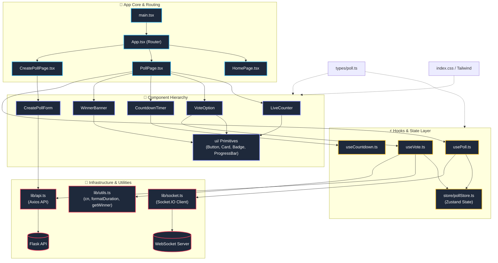
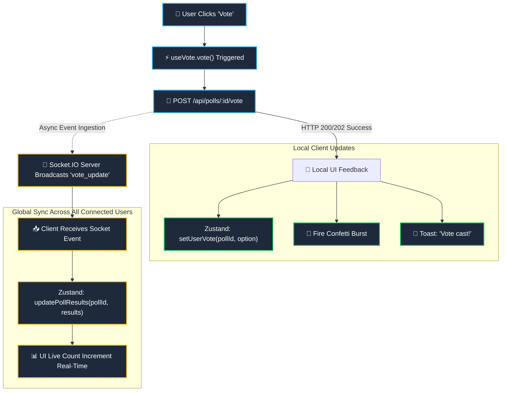

# VoteLive Frontend

A modern, real time voting interface built with **React 18**, **TypeScript**, **Vite**, **Tailwind CSS**, **Zustand**, and **Framer Motion**.

[](https://react.dev/)
[](https://www.typescriptlang.org/)
[](https://vitejs.dev/)
[](https://tailwindcss.com/)
[](https://github.com/pmndrs/zustand)

---

## Tech Stack

| Layer | Technology |
|-------|------------|
| Framework | React 18 + TypeScript |
| Build Tool | Vite |
| Styling | Tailwind CSS |
| State Management | Zustand |
| Animations | Framer Motion |
| Real-Time | Socket.IO Client |
| HTTP Client | Axios |
| Notifications | Sonner |
| Icons | Lucide React |
| Effects | Canvas Confetti |

---

## Quick Start

```bash
cd frontend
cp .env.example .env
npm install
npm run dev
```

The dev server starts at `http://localhost:3000`.

---

## Environment Variables

Create a `.env` file from `.env.example`:

```bash
VITE_API_URL=http://localhost:5000/api
VITE_WS_URL=http://localhost:8000
```

| Variable | Description |
|----------|-------------|
| `VITE_API_URL` | Flask backend API base URL |
| `VITE_WS_URL` | Socket.IO WebSocket server URL |

---

## Project Structure



---

## Pages

### `/` — Home
- Hero section with CTA
- Tabbed poll grid: **All** / **Live** / **Ended**
- Auto-refreshes every 30 seconds
- Skeleton loading states

### `/poll/:id` — Vote
- Live countdown timer (turns red under 5 min)
- Vote buttons with animated progress bars
- Real time vote counts via WebSocket
- Confetti burst on vote
- Auto disables when poll ends
- Winner banner with trophy animation when closed

### `/create` — New Poll
- Question input
- Dynamic options (2 to 6, add/remove)
- Duration picker (5 min to 24 hours)
- Creator name (optional)
- Redirects to new poll on success

---

## Key Features

| Feature | How It Works |
|---------|--------------|
 | **Real Time Updates** | Socket.IO listens for `vote_update` events; Zustand updates global state |
| **Optimistic Voting** | UI updates immediately, rolls back on error |
| **Atomic Timer** | `useCountdown` hook syncs every second; expires trigger UI lock |
| **Winner Detection** | `getWinner()` handles ties and single winners |
| **Responsive** | Mobile first Tailwind; grid adapts 1→2→3 columns |
| **Accessible** | Keyboard navigable buttons, focus rings, ARIA labels |

---

## State Flow



---

## Build for Production

```bash
npm run build
```

Output goes to `dist/`. Serve with any static host (Vercel, Netlify, Nginx).

---

## Proxy Setup

Vite dev server proxies `/api` to the Flask backend:

```ts
// vite.config.ts
server: {
  proxy: {
    '/api': {
      target: 'http://localhost:5000',
      changeOrigin: true,
      rewrite: (path) => path.replace(/^\/api/, ''),
    },
  },
}
```

No CORS issues in development.

---

## Troubleshooting

| Issue | Fix |
|-------|-----|
| `Cannot find module '@/'` | Restart Vite dev server; path aliases are pre-configured |
| Socket not connecting | Check `VITE_WS_URL` matches your WebSocket server port |
| CORS errors in production | Ensure Flask `CORS(app)` allows your frontend domain |
| Polls not appearing | Verify `GET /api/polls` returns array with `status` field |

---

## License

MIT — same as the backend.
