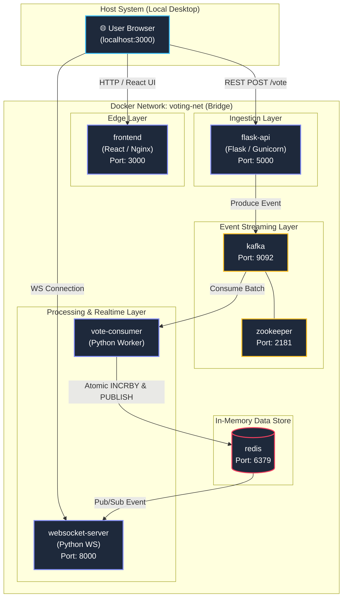

# 🛠️ Infrastructure & Orchestration Architecture — Real Time Voting System

> This document details the multi container infrastructure, network topology, environment configurations, and orchestration workflows powering the real time voting system.

[](#)
[](#)
[](#)
[](#)
[](#)
[](#)
[](#)

<!-- Port Allocation Badge -->


<!-- Kubernetes Ready Badge -->


---
## 🏗️ Container Orchestration Topology
All services run inside an isolated Docker bridge network (voting net), enabling container to container service discovery via container names while exposing specific ports to the host system.


## 📊 Service Catalog & Network Port Directory

| Service Name | Image / Build Context | Internal Port | Host Port | Purpose | Health Check / Readiness |
| --------| --------| --------| --------| --------| --------| 
| zookeeper | confluentinc/cp-zookeeper:7.5.0 | 2181 | 2181 | Kafka cluster management & metadata tracking | TCP port 2181 open |
| kafka | confluentinc/cp-kafka:7.5.0 | 9092 | 9092 | Event streaming broker for vote ingestion |kafka-topics --list check |
| redis| redis:7-alpine| 6379 | 6379 | In-memory count storage & Pub/Sub broker | redis-cli ping returns PONG | 
| flask-api | ./backend/Dockerfile | 5000 | 5000 | Ingestion API & vote producer | GET /api/health returns 200 |
| vote-consumer | ./backend/Dockerfile| N/A| N/A | Queue consumer, updating Redis & publishing |Process execution active |
| websocket-server | ./backend/Dockerfile | 8000 | 8000 | Async WebSocket server fanning out Redis events | WS connection test|
| frontend| ./frontend/Dockerfile| 3000| 3000| React production UI client|GET / returns 200|

---
## 📄 Reference Deployment (```docker-compose.yml```)

Save the following specification in the project root to orchestrate the complete stack:

```YAML
version: '3.8'

networks:
  voting-net:
    driver: bridge

volumes:
  kafka_data:
  zookeeper_data:
  redis_data:

services:
  # --- INFRASTRUCTURE SERVICES ---
  zookeeper:
    image: confluentinc/cp-zookeeper:7.5.0
    container_name: voting-zookeeper
    networks:
      - voting-net
    environment:
      ZOOKEEPER_CLIENT_PORT: 2181
      ZOOKEEPER_TICK_TIME: 2000
    volumes:
      - zookeeper_data:/var/lib/zookeeper/data

  kafka:
    image: confluentinc/cp-kafka:7.5.0
    container_name: voting-kafka
    depends_on:
      - zookeeper
    networks:
      - voting-net
    ports:
      - "9092:9092"
    environment:
      KAFKA_BROKER_ID: 1
      KAFKA_ZOOKEEPER_CONNECT: zookeeper:2181
      KAFKA_ADVERTISED_LISTENERS: PLAINTEXT://kafka:29092,PLAINTEXT_HOST://localhost:9092
      KAFKA_LISTENER_SECURITY_PROTOCOL_MAP: PLAINTEXT:PLAINTEXT,PLAINTEXT_HOST:PLAINTEXT
      KAFKA_INTER_BROKER_LISTENER_NAME: PLAINTEXT
      KAFKA_OFFSETS_TOPIC_REPLICATION_FACTOR: 1
    volumes:
      - kafka_data:/var/lib/kafka/data

  redis:
    image: redis:7-alpine
    container_name: voting-redis
    networks:
      - voting-net
    ports:
      - "6379:6379"
    command: redis-server --appendonly yes
    volumes:
      - redis_data:/data
    healthcheck:
      test: ["CMD", "redis-cli", "ping"]
      interval: 5s
      timeout: 3s
      retries: 5

  # --- APPLICATION SERVICES ---
  flask-api:
    build:
      context: ./backend
      dockerfile: Dockerfile
    container_name: voting-flask-api
    command: gunicorn --bind 0.0.0.0:5000 --workers 4 --threads 2 "app:create_app()"
    depends_on:
      kafka:
        condition: service_started
      redis:
        condition: service_healthy
    networks:
      - voting-net
    ports:
      - "5000:5000"
    environment:
      KAFKA_BOOTSTRAP_SERVERS: kafka:29092
      REDIS_HOST: redis
      REDIS_PORT: 6379

  vote-consumer:
    build:
      context: ./backend
      dockerfile: Dockerfile
    container_name: voting-consumer
    command: python -m app.consumers.vote_consumer
    depends_on:
      kafka:
        condition: service_started
      redis:
        condition: service_healthy
    networks:
      - voting-net
    environment:
      KAFKA_BOOTSTRAP_SERVERS: kafka:29092
      REDIS_HOST: redis
      REDIS_PORT: 6379

  websocket-server:
    build:
      context: ./backend
      dockerfile: Dockerfile
    container_name: voting-websocket
    command: python websocket_server.py
    depends_on:
      redis:
        condition: service_healthy
    networks:
      - voting-net
    ports:
      - "8000:8000"
    environment:
      REDIS_HOST: redis
      REDIS_PORT: 6379

  frontend:
    build:
      context: ./frontend
      dockerfile: Dockerfile
    container_name: voting-frontend
    networks:
      - voting-net
    ports:
      - "3000:3000"
    environment:
      VITE_API_URL: http://localhost:5000/api
      VITE_WS_URL: ws://localhost:8000
```

--- 

## 🔑 Environment Variables Matrix

| Component| Variable Name | Default Value | Description |
| -----| -----| -----| -----|
| Flask API / Consumer | KAFKA_BOOTSTRAP_SERVERS | kafka:29092 | Internal Kafka broker connection address|
|Backend Services | REDIS_HOST | redis | Internal host name for Redis service discovery |
| Backend Services | REDIS_PORT | 6379 | Network port for Redis instance | 
| Frontend UI | VITE_API_URL | http://localhost:5000/api | REST API base endpoint for voting actions | 
| Frontend UI | VITE_WS_URL | ws://localhost:8000 | WebSocket broker endpoint for real time updates | 

---

## 🛠️ Operations & Lifecycle Runbook
1. Provisioning & Bootstrapping Stack
Start all infrastructure and core application containers detached:

```Bash
docker-compose up -d
```
2. Inspecting Cluster Health & Logs
Monitor live aggregate logs across the voting stack:

```Bash
# View combined runtime logs
docker-compose logs -f

# Inspect specific service logs
docker-compose logs -f kafka
docker-compose logs -f vote-consumer
```
3. Scaling Consumer Workers Horizontally
To address high volume incoming vote spikes, increase the number of worker instances reading from the votes topic:

```Bash
docker-compose up -d --scale vote-consumer=3
```
**Note**: Ensure the votes topic has at least as many partitions as active consumers to enable parallel processing.

4. Database & Queue Maintenance Commands
```Bash
# Verify Kafka topic creation
docker exec -it voting-kafka kafka-topics --list --bootstrap-server localhost:9092

# Inspect live Redis vote counter keys
docker exec -it voting-redis redis-cli KEYS "poll:*"

# Teardown stack and purge persistent volumes
docker-compose down -v
```
---

## 📈 Fault Tolerance & Persistence Strategies

- Redis Persistence: Configured with appendonly yes (AOF) mapped to host volume redis_data to ensure vote counts survive container restarts.

- Kafka Event Durability: Topic votes uses poll_id as the partition key. This guarantees that all votes for a specific poll land on the same partition in sequential order, preventing state race conditions.

- At Least-Once Consumer Guarantees: Consumer workers commit Kafka offsets only after executing INCRBY and PUBLISH operations in Redis, protecting against message loss during worker crashes.